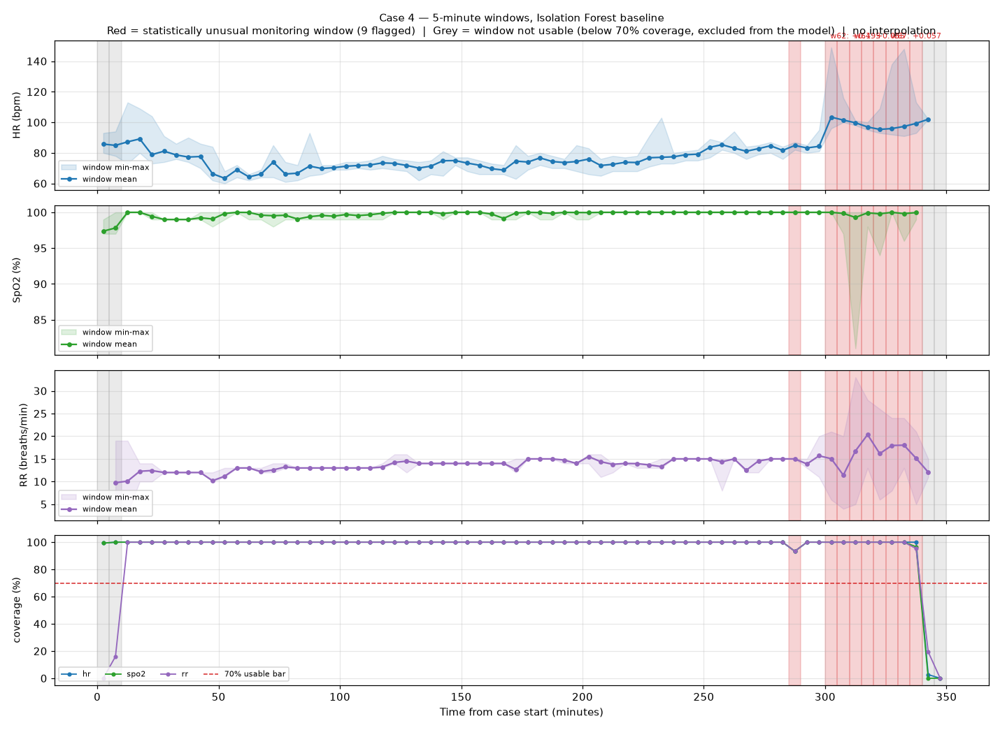
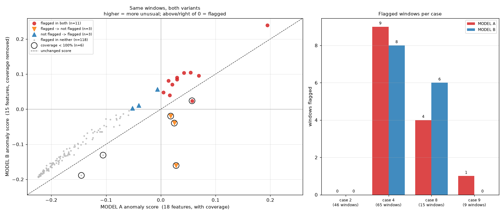

# VitalDB Monitoring Baseline

An end-to-end prototype that turns raw [VitalDB](https://vitaldb.net) intraoperative
monitoring signals into ranked, explainable *statistically unusual monitoring windows* —
without interpolating, imputing, or fabricating a single observation.

> **This is not a clinical tool.** There is no ground-truth anomaly label in this data.
> A flagged window is an **unusual physiological feature pattern**, not an adverse event,
> not deterioration, and not a validated clinical finding. No accuracy, precision, recall,
> F1, AUROC or AUPRC is reported anywhere, because none of them are defined here.

## Pipeline

```
Raw VitalDB tracks (~0.5 Hz)
    ↓  aggregate.py       5-minute non-overlapping windows, 70% coverage bar
    ↓  features.py        28-column feature table, causal, no fill
    ↓  anomaly.py         Isolation Forest baseline
    ↓  ablation.py        controlled coverage-feature ablation → Model B
    ↓  evidence.py        structured evidence objects per flagged window
       (XAI/LLM explanation layer — next milestone)
```

Each stage has a `*_checkpoint.py` runner at the repo root that regenerates its
outputs and prints a verification report.

## Results

| | |
|---|---|
| Cases analyzed | 4 (VitalDB cases 2, 4, 8, 9) |
| 5-minute windows | 158 total, 139 usable, **135 analyzed** |
| Windows flagged | **14** (10.4%, contamination = 0.10) |
| Tests | **223 passing** |

The strongest detected region is **case 4, 300–340 min**: eight contiguous flagged
windows where HR steps ~85→103 bpm and respiratory rate destabilizes.



## Data-handling contract

These rules are enforced in code and covered by tests, not merely documented:

- **No interpolation, no fill, no imputation.** A missing statistic stays `NULL`. It is
  never replaced by `0`, a sentinel, or the previous window's value.
- **Low-coverage windows survive.** Every window becomes a row, including unusable ones.
  Dropping them would make a monitoring outage look like continuous data.
- **Strictly causal.** Row *k* is a function of windows `0..k` only. Verified by rebuilding
  each row from a truncated history and requiring an identical result.
- **No cross-case references.** Deltas and run-counters reset at every case boundary.
- **Deltas step over gaps, they don't span them silently.** `{signal}_delta` compares
  against the most recent earlier window in which *that signal* was usable, which is not
  necessarily window `k-1`.
- **Identifiers are never model inputs.** `caseid`, `window_index` and timestamps are
  carried for traceability but excluded from the feature matrix, so the model cannot
  learn "case 4 is unusual".

## The coverage ablation

The first baseline used 18 features including per-signal coverage percentages. But
129 of 135 analyzed windows sit at exactly 100% coverage, making those columns nearly
degenerate — and Isolation Forest isolates on rare values, so a window at 72% coverage
was separable in a single split.

A controlled ablation (identical rows, seed, contamination, tree count; only the three
coverage columns removed) produced a clean result:

**The set of windows whose score dropped is exactly the set of windows with <100% coverage.**
All 6 low-coverage windows fell; all 129 full-coverage windows rose. No exceptions.



Flags on sub-100%-coverage windows went 4 → 1, and flags below 90% coverage went 2 → 0.
**Model B (15 physiological features) is the baseline** for the prototype.

## Repository layout

```
src/vitaldb_audit/
  fetch, profile, signals, select, probe, inspect_signals   reconnaissance
  aggregate.py    5-minute windowing + coverage accounting
  features.py     Feature Schema v1 (28 columns)
  anomaly.py      Isolation Forest baseline
  ablation.py     controlled coverage-feature ablation
  evidence.py     structured evidence objects for the XAI layer
  class_profile.py  descriptive class profile (unsupervised, no ground truth)
tests/            223 tests, fully offline
docs/             feature schema design document
results/          published artifacts (see below)
```

Published artifacts in `results/`:

- `features/feature_table_5min.csv` — the 158×28 feature table
- `model/` — **Model B, the canonical baseline** (results, summary); Model A is
  preserved as the ablation control in `model/model_a_control/`
- `ablation/` — comparison CSV, Model B results, ablation summary
- `xai/evidence_cases.json` — 14 structured evidence objects, with mean-change and
  dispersion flags plus the full arithmetic behind each
- `model/class_profile.json` — descriptive class profile: support, per-class score
  distributions, per-case composition, and Cliff's delta feature separation
- `plots/` — trajectory, coverage, score-distribution, ablation and class-profile figures

The fitted `.joblib` model is gitignored (2 MB binary, regenerated by
`model_checkpoint.py`), as are the raw VitalDB payloads (reproducible from the
public API).

## Running it

```bash
python -m venv .venv && .venv/bin/pip install -r requirements.txt
.venv/bin/python -m pytest -q            # 223 tests, offline, no network

# Regenerate each stage (needs cached raw signals under data/raw/)
.venv/bin/python feature_checkpoint.py
.venv/bin/python model_checkpoint.py
.venv/bin/python ablation_checkpoint.py
.venv/bin/python promote_model_b.py      # makes results/model/ canonical Model B
.venv/bin/python evidence_checkpoint.py
.venv/bin/python class_profile_checkpoint.py
```

The reconnaissance and aggregation stages fetch from the public VitalDB API on first
run and cache payloads under `data/raw/`; everything downstream is offline.

## Known limitations

- **Four cases.** "Unusual" means unusual relative to these four. Case 4 supplies half
  the analyzed population, so it disproportionately defines normal.
- **Contamination fixes the flag count.** 14 flagged windows is a parameter choice, not
  a measurement.
- **SpO2 and RR are near-constant** in these cases — SpO2 is exactly 100.0 in 94 of 154
  windows, RR exactly 12.0 in 38 of 146 (ventilator set rate). HR carries most of the
  variance, so the detector is substantially an HR detector.
- **Coverage is still a selection confound.** It no longer feeds the model, but the 70%
  bar decides which windows are modeled at all. Case 8's most dramatic SpO2 decline sits
  in excluded windows.
- **Model B keys mostly on within-window dispersion, not mean shifts** (flagged windows
  have hr_range 21.5 vs 8.0 and rr_std 3.37 vs 0.0, while |hr_delta| is 1.86 vs 1.95 —
  indistinguishable). The evidence layer therefore carries both `*_changed` (mean shift)
  and `*_dispersion_unusual` (within-window spread) flags. The dispersion flag is
  computed over the whole case, so it is valid as post-hoc explanation but is **not
  causal** and must never be fed back into the feature table or the detector.
- **One seed.** No seed sweep was run; small rank changes are not meaningful.

## Data

VitalDB is an open biosignal dataset from Seoul National University Hospital, released
for research use. This repository contains **no raw waveform data and no patient
identifiers** — only derived per-window statistics (means, dispersion, coverage) for
four cases. Raw payloads are fetched from the public API at runtime and gitignored.
